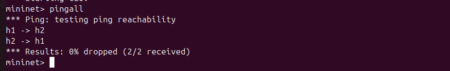
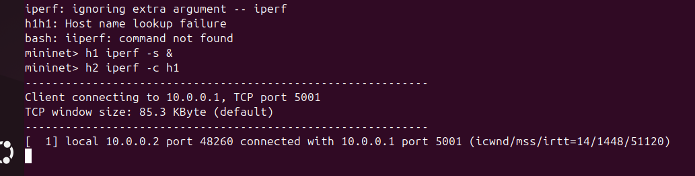

# SDN Packet Logger using POX Controller

## 📌 Problem Statement

This project implements a Software Defined Networking (SDN) solution using Mininet and POX controller to capture and log packets traversing the network.

---

## 🎯 Objectives

* Demonstrate controller–switch interaction
* Implement OpenFlow match-action rules
* Capture and log packet details
* Identify protocol types (ICMP, TCP, UDP)

---

## 🛠️ Tools Used

* Mininet
* POX Controller
* OpenFlow Protocol
* iperf

---

## ⚙️ Setup & Execution

### Start Controller

```bash
cd ~/pox
./pox.py misc.packetlogger
```

### Start Mininet

```bash
sudo mn --topo single,3 --controller remote
```

### Test Commands

```bash
pingall
iperf
```

---

## 🧠 Controller Logic

* The controller listens for `PacketIn` events.
* When a packet arrives:

  * Extracts Ethernet, IPv4, TCP/UDP/ICMP details
  * Logs packet information
* Installs flow rules:

  * Match: Based on packet fields
  * Action: Flood to all ports

---

## 🧪 Test Scenarios

### 1. Normal Communication

* Hosts successfully ping each other
* ICMP packets logged in controller

### 2. Traffic Generation

* TCP/UDP traffic generated using iperf
* Controller logs protocol types

---

## 📊 Observations

* First packet triggers PacketIn event
* Flow rules installed dynamically# SDN Packet Logger using POX Controller

## 📌 Problem Statement

This project implements a Software Defined Networking (SDN) solution using Mininet and POX controller to capture and log packets traversing the network.

---

## 🎯 Objectives

* Demonstrate controller–switch interaction
* Implement OpenFlow match-action rules
* Capture and log packet details
* Identify protocol types (ICMP, TCP, UDP)

---

## 🛠️ Tools Used

* Mininet
* POX Controller
* OpenFlow Protocol
* iperf

---

## ⚙️ Setup & Execution

### Start Controller

```bash
cd ~/pox
./pox.py misc.packetlogger
```

### Start Mininet

```bash
sudo mn --topo single,3 --controller remote
```

### Test Commands

```bash
pingall
iperf
```

---

## 🧠 Controller Logic

* The controller listens for `PacketIn` events.
* When a packet arrives:

  * Extracts Ethernet, IPv4, TCP/UDP/ICMP details
  * Logs packet information
* Installs flow rules:

  * Match: Based on packet fields
  * Action: Flood to all ports

---

## 🧪 Test Scenarios

### 1. Normal Communication

* Hosts successfully ping each other
* ICMP packets logged in controller

### 2. Traffic Generation

* TCP/UDP traffic generated using iperf
* Controller logs protocol types

---

## 📊 Observations

* First packet triggers PacketIn event
* Flow rules installed dynamically
* Subsequent packets follow installed rules
* Reduced controller involvement

---

## 📸 Screenshots





---

## ✅ Conclusion

This project successfully demonstrates SDN controller behavior, packet monitoring, and dynamic flow rule installation using POX controller.

* Subsequent packets follow installed rules
* Reduced controller involvement


## ✅ Conclusion

This project successfully demonstrates SDN controller behavior, packet monitoring, and dynamic flow rule installation using POX controller.
